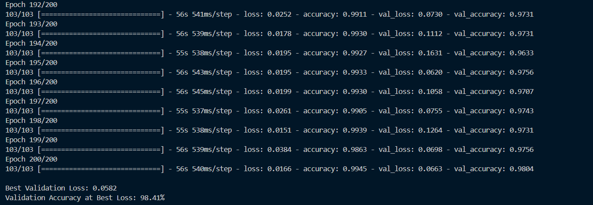

# Image Classification using handcrafted features passed through SVM and MLP(Part A)

## Dataset
The dataset is organized into two subdirectories: "without_mask" and "with_mask."

- The "without_mask" directory contains images of faces without masks.

- The "with_mask" directory contains images of faces wearing masks.

## Methodology
### Data Preprocessing
- The image is grayscaled and the handcrafted features i.e., HOG(Histogram of Oriented Gradients) and LBP(Local Binary Pattern) features are extracted.
- The labels are encoded using LabelEncoder() and the dataset is then split into 2 parts: 80% training and 20% validation sets.

### Model Training
- A Support Vector Machine (SVM) classifier with a linear kernel is trained and evaluated on the test data, achieving an accuracy of 90.72%.
- A Multi-Layer Perceptron (MLP) classifier with 100 neurons in the hidden layer is trained and evaluated for 500 iterations, achieving an accuracy of 94.63%.

# Image Classification using Custom CNN(Part B)

## Methodology

### Data Preprocessing
- The dataset is preprocessed using `ImageDataGenerator` to apply data augmentation, including:
  - Rescaling pixel values to [0,1] range.
  - Random rotation, width/height shifts, shearing, zooming, and horizontal flipping.
  - Splitting data into training (80%) and validation (20%) sets.
- The dataset consists of `10,000` images categorized into `2` classes.
- Images are resized to `224x224` pixels for consistency with the CNN model.

### Model Architecture
- A Convolutional Neural Network (CNN) is built using the following layers:

The architecture consists of multiple convolutional layers followed by max-pooling layers to progressively reduce spatial dimensions while extracting important features. A fully connected dense layer is used before the final output layer to make predictions. Dropout is applied to reduce overfitting. The detailed structure is as follows:

| Layer | Depth (Channels) | Height | Width | Filter Height | Filter Width |
|---|---|---|---|---|---|
| Input Layer | 3 | 224 | 224 | - | - |
| Conv2D (32 filters, 3×3) | 32 | 224 | 224 | 3 | 3 |
| Conv2D (32 filters, 3×3) | 32 | 224 | 224 | 3 | 3 |
| MaxPooling2D (2×2) | 32 | 112 | 112 | 2 | 2 |
| Conv2D (64 filters, 3×3) | 64 | 112 | 112 | 3 | 3 |
| Conv2D (64 filters, 3×3) | 64 | 112 | 112 | 3 | 3 |
| MaxPooling2D (2×2) | 64 | 56 | 56 | 2 | 2 |
| Conv2D (128 filters, 3×3) | 128 | 56 | 56 | 3 | 3 |
| Conv2D (128 filters, 3×3) | 128 | 56 | 56 | 3 | 3 |
| MaxPooling2D (2×2) | 128 | 28 | 28 | 2 | 2 |
| Conv2D (256 filters, 3×3) | 256 | 28 | 28 | 3 | 3 |
| Conv2D (256 filters, 3×3) | 256 | 28 | 28 | 3 | 3 |
| MaxPooling2D (2×2) | 256 | 14 | 14 | 2 | 2 |
| GlobalAveragePooling2D | 256 | 1 | 1 | - | - |
| Fully Connected (Dense 256) | 256 | 1 | 1 | - | - |
| Dropout (50%) | 256 | 1 | 1 | - | - |
| Output Layer (Dense 1) | 1 | 1 | 1 | - | - |

### Training Process
- The model was trained using binary cross-entropy loss and accuracy as the evaluation metric.
- The selected hyperparameters (`1e-4` learning rate, Adam optimizer, batch size `32`) were determined after extensive experimentation (described in the next section).
- The model was trained for `200` epochs as it provided the best balance between accuracy and validation loss.
- Accuracy and validation loss were tracked over epochs, and early stopping mechanisms were considered but not applied in the final run.

## Hyperparameters and Experiments
To determine the best configuration, multiple hyperparameters were tested, and their impact on validation loss and accuracy was analyzed. The following variations were tested:

### Learning Rate Selection
- The model was first trained for `10` epochs with different learning rates (`1e-3` and `1e-4`).
- **Results:**
  - `1e-3`: Validation loss `0.2543`, accuracy `92.18%`
  - `1e-4`: Validation loss `0.2166`, accuracy `93.18%`
- The lower learning rate (`1e-4`) resulted in a better validation loss, indicating better generalization and less overfitting.

### Optimizer Selection
- With `1e-4` as the chosen learning rate, different optimizers were tested:
  - **Adam:** Validation loss `0.2166`, accuracy `93.18%`
  - **SGD:** Validation loss `0.6922`, accuracy `52.81%`
- The results showed that Adam significantly outperformed SGD, which had both a higher loss and much lower accuracy. Thus, Adam was chosen.

### Batch Size Selection
- Keeping the learning rate (`1e-4`) and optimizer (Adam) fixed, batch sizes of `16` and `32` were tested:
  - **Batch size 16:** Validation loss `0.1777`, accuracy `94.99%`
  - **Batch size 32:** Validation loss `0.2166`, accuracy `93.18%`
- While batch size `16` had a lower validation loss, its training process showed large fluctuations, making the model less stable. Hence, batch size `32` was selected as the optimal trade-off between stability and performance.
- **Note:** Larger batch sizes (e.g., `64`) could not be tested due to GPU memory constraints, as the program kept crashing.

### Epoch Selection
- The best hyperparameter set (`1e-4` learning rate, Adam optimizer, batch size `32`) was then used to train the model for longer durations:
  - **50 epochs:** Validation loss `0.1069`, accuracy `96.21%`
  - **200 epochs:** Validation loss `0.0582`, accuracy `98.41%`
- As training for `200` epochs provided the lowest validation loss and highest accuracy, it was chosen for the final model.

### Validation Accuracy and Loss Graphs



## Results
- **Final Model Performance:**
  - **Best Hyperparameters:** Learning rate `1e-4`, Adam optimizer, batch size `32`, `200` epochs.
  - **Final Metrics:** Validation loss `0.0582`, Accuracy `98.41%`
- **Performance Summary:**
  - Lower learning rates improved generalization.
  - Adam optimizer significantly outperformed SGD.
  - A batch size of `32` provided the best stability and performance.
  - Increasing epochs improved accuracy, with `200` being the best.

## Observations and Analysis

### Insights Gained
- The model achieved a **98.41% validation accuracy**, demonstrating that the CNN effectively learns relevant patterns from the dataset.
- **Lower learning rates** improved generalization, reducing the risk of overfitting.
- The **Adam optimizer significantly outperformed SGD**, highlighting the importance of adaptive learning rates in deep learning.
- A **batch size of 32** offered a good trade-off between stability and performance.
- Training for **200 epochs** provided the best balance between accuracy and validation loss.

### Challenges Faced and Solutions

#### Overfitting in Early Experiments
- **Issue:** Initially, the model showed high training accuracy but poor validation performance.
- **Solution:** Introduced **dropout layers** to enhance generalization.

#### Fluctuating Validation Loss
- **Issue:** Smaller batch sizes (16) led to unstable training curves.
- **Solution:** Increased batch size to **32**, which resulted in smoother loss curves.

#### GPU Memory Constraints
- **Issue:** Training with batch sizes larger than 32 led to memory crashes.
- **Solution:** Kept batch size at **32** while optimizing model efficiency.

#### Choosing the Right Epochs
- **Issue:** Early stopping wasn't used, but finding the right number of epochs was crucial.
- **Solution:** Experiments showed that **200 epochs** provided the best results.


## How to Run the Code

### Prerequisites
Ensure you have Python and the necessary dependencies installed:
```bash
pip install tensorflow numpy matplotlib
```

### Steps to Execute
1. **Prepare Dataset:** Place your dataset in a directory named `dataset/`.
2. **Run Training:** Run the cells related to Part B in the notebook `Part_A_B.ipynb`.
3. **Results:** The training and validation accuracy/loss plots will be displayed.
4. **Modify Hyperparameters:** Edit the script to test different configurations.

### Expected Output
- Training logs with accuracy and loss metrics.
- A graph showing training/validation accuracy and loss over epochs.
- The best validation loss and corresponding accuracy printed at the end.

This project provides a robust baseline CNN model for image classification, with options for tuning and experimenting further.


# Image Classification using Pretrained VGG16(PartB Optional)

## Data Preprocessing
- The dataset is preprocessed using `ImageDataGenerator` to apply data augmentation, including:
  - Rescaling pixel values to [0,1] range.
  - Random rotation, width/height shifts, shearing, zooming, and horizontal flipping.
  - Splitting data into training (80%) and validation (20%) sets.
- Images are resized to `224x224` pixels for consistency with the pretrained model.

## Pretrained Model
This project leverages the VGG16 model as a pretrained backbone for image classification. The VGG16 model is initialized with ImageNet weights, and its convolutional base is frozen during initial training to utilize its learned features effectively. The final classification layers are trained on the given dataset.

### Model Details
- **Base Model**: VGG16 (pretrained on ImageNet)
- **Trainable Layers**: Fully connected layers added on top of the base model
- **Loss Function**: Binary Crossentropy
- **Evaluation Metrics**: Accuracy
- **Optimizers Tested**: Adam, SGD

## Model Architecture
The architecture consists of the VGG16 base model followed by additional dense layers for classification. The structure is as follows:

| Layer | Type | Output Shape |
|---|---|---|
| Input | Image (224, 224, 3) | (224, 224, 3) |
| VGG16 Base Model | Pretrained Convolutional Layers | (7, 7, 512) |
| Flatten | Convert to 1D | (25088) |
| Dense (256) | Fully Connected | (256) |
| Dropout (50%) | Regularization | (256) |
| Output Layer (Dense 1) | Classification | (1) |

## Training Process
- The model was trained using binary cross-entropy loss and accuracy as the evaluation metric.
- The selected hyperparameters (`1e-4` learning rate, Adam optimizer, batch size `16`) were determined after extensive experimentation.
- The model was trained for `150` epochs to achieve optimal accuracy and generalization.
- Accuracy and validation loss were tracked over epochs.

## Hyperparameters and Experiments
To determine the best configuration, multiple hyperparameters were tested, and their impact on validation loss and accuracy was analyzed. The following variations were tested:

### Learning Rate Selection
- **Learning rate = 1e-3 (Adam, batch size = 16)**
  - Validation Loss: 0.0711
  - Validation Accuracy: 97.43%
- **Learning rate = 1e-4 (Adam, batch size = 16)**
  - Validation Loss: 0.0714
  - Validation Accuracy: 97.31%

Although 1e-3 showed slightly better accuracy, 1e-4 was chosen because it provided more stable training with less fluctuation in loss. The model trained with 1e-3 showed higher variance, indicating potential overfitting.

### Optimizer Selection
- **Adam (learning rate = 1e-4, batch size = 16)**
  - Validation Loss: 0.0714
  - Validation Accuracy: 97.31%
- **SGD (learning rate = 1e-4, batch size = 16)**
  - Validation Loss: 0.1797
  - Validation Accuracy: 96.94%

Since Adam provided a significantly lower validation loss and higher accuracy than SGD, it was chosen as the final optimizer.

### Batch Size Selection
- **Batch size 16:** Validation loss `0.0714`, accuracy `97.31%`
- **Batch size 32:** Could not be tested due to GPU memory constraints.

### Final Training (Best Parameters: Adam, learning rate = 1e-4, batch size = 16)
- **Epochs = 150**
- **Validation Loss = 0.0189**
- **Validation Accuracy = 99.76%**


## Results and Evaluation
- **Final Model Performance:**
  - **Best Hyperparameters:** Learning rate `1e-4`, Adam optimizer, batch size `16`, `150` epochs.
  - **Final Metrics:** Validation loss `0.0189`, Accuracy `99.76%`
- **Performance Summary:**
  - Lower learning rates improved generalization.
  - Adam optimizer significantly outperformed SGD.
  - Batch size `16` was chosen due to memory constraints.

### Validation Accuracy and Loss Graphs


## Observations and Analysis
- **Insights Gained:** The pretrained VGG16 model significantly improved performance compared to training a model from scratch. Lower learning rates helped in better generalization, while Adam proved to be a superior optimizer for stability.
- **Challenges Faced:**
  - **GPU Memory Constraints:** Limited ability to test larger batch sizes.
  - **Overfitting:** Initially observed with higher learning rates, mitigated by reducing learning rate and adding dropout.
- **Solutions Implemented:**
  - Used batch size `16` to balance memory usage and performance.
  - Regularization techniques like dropout were applied to reduce overfitting.
  - Adjusted learning rates and optimizers to improve stability.


## How to Run the Code

### Prerequisites
Ensure you have Python and the necessary dependencies installed:
```bash
pip install tensorflow numpy matplotlib
```

### Steps to Execute
1. **Prepare Dataset:** Place your dataset in a directory named `dataset/`.
2. **Run Training:** Run the cells related to Part B(optional) in the notebook `Part_A_B.ipynb`.
3. **Results:** The training and validation accuracy/loss plots will be displayed.
4. **Modify Hyperparameters:** Edit the script to test different configurations.

### Expected Output
- Training logs with accuracy and loss metrics.
- A graph showing training/validation accuracy and loss over epochs.
- The best validation loss and corresponding accuracy printed at the end.


## Comparison among Different Models

- **SVM (Part A)**
  - **Validation Accuracy:** 90.72%
  - **Validation Loss:** 0.1152

- **MLP (Part A)**
  - **Validation Accuracy:** 94.63%
  - **Validation Loss:** 0.0897  

- **Custom CNN (Part B):**
  - **Validation Accuracy:** 98.41%
  - **Validation Loss:** 0.0582

- **Pretrained VGG16 (Part B Optional):**
  - **Validation Accuracy:** 99.76%
  - **Validation Loss:** 0.0582
  
The superior performance of the pretrained VGG16 (99.76% accuracy) compared to the custom CNN (98.41%), MLP (94.63%), and SVM (90.72%) suggests that the dataset contains spatial features that benefit from deep convolutional feature extraction. The performance difference likely arises from VGG16’s extensive pretraining on large-scale image datasets (e.g., ImageNet), enabling it to learn richer and more transferable feature representations. In contrast, the custom CNN was trained from scratch, lacking these hierarchical representations, which limited its performance.

The CNN outperformed the MLP, indicating that convolutional filters helped extract meaningful spatial patterns, but its advantage was not as pronounced as VGG16’s due to the absence of pretraining. SVM performed the worst, as it lacks the ability to capture complex spatial dependencies. Additionally, increasing the number of layers in the custom CNN raises the number of trainable parameters, leading to excessive computational demands that may exceed GPU capacity, further limiting its effectiveness.


# Segmentation and IoU Evaluation Project

## i. Introduction
This part of project focuses on image segmentation and evaluates the performance of the segmentation using the Intersection over Union (IoU) metric. The goal is to extract the best contour from an image and compare it against a ground truth mask to assess segmentation accuracy. Specifically, this project aims to extract masks for faces identified as "with masks" using traditional segmentation techniques such as thresholding and morphological operations. The segmentation process helps in identifying the masked regions in facial images, providing a structured approach for evaluation.

## ii. Dataset
- **Source:** The dataset consists of images stored in `MSFD/1/face_crop` and corresponding ground truth segmentation masks in `MSFD/1/face_crop_segmentation`.
- **Structure:**
  - `face_crop/` contains original face images.
  - `face_crop_segmentation/` contains binary segmentation masks for the corresponding images.

## iii. Methodology
The following steps were performed for segmentation and evaluation:

### 1. **Preprocessing**
   - **Convert to grayscale:** Convert the original RGB image to a single-channel grayscale image to simplify processing.
   - **Apply Gaussian Blur:** A **3x3 Gaussian kernel** is used to smooth the image and reduce noise before thresholding.
   - **Thresholding:** Otsu’s thresholding is applied to separate the object (masked face) from the background by automatically determining the optimal threshold value.
   - **Morphological Closing:** A **5x5 structuring element** (kernel) is used to perform morphological closing, which helps to fill small holes and gaps in the detected mask.

### 2. **Contour Extraction**
   - **Find contours:** Contours are extracted using `cv.findContours` with the `RETR_EXTERNAL` mode, which retrieves only the outermost contours.
   - **Select the largest contour:** Contours are sorted by area, and the largest contour is assumed to represent the masked face region.
   - **Draw the selected contour:** A blank mask of size **256x256 pixels** is created, and the largest contour is drawn onto it to obtain the final segmented region.

### 3. **IoU Calculation**
   - **Load the ground truth mask:** The corresponding segmentation mask is read and thresholded to ensure binary values (0 or 255).
   - **Resize the generated mask:** The extracted segmentation mask is resized using **nearest-neighbor interpolation** to match the dimensions of the ground truth mask.
   - **Compute IoU:** IoU is calculated as:
     \[
     IoU = \frac{\text{Intersection (overlapping pixels)}}{\text{Union (total covered pixels)}}
     \]
     where intersection is the number of pixels common between both masks, and union is the total number of pixels covered by at least one mask.

### 4. **Results Storage & Visualization**
   - **Save segmented masks:** The extracted segmentation masks are stored in the `saved_results/` directory with filenames prefixed by `segmented_`.
   - **Random sample visualization:** 10 random images are selected for visualization, displaying:
     - **Original image** (RGB format)
     - **Ground truth mask** (grayscale)
     - **Generated segmentation mask** (grayscale with IoU score overlayed)
   - **Display output using Matplotlib:** The results are displayed in a 3-column subplot format for side-by-side comparison.

## iv. Results
The model's performance was evaluated using the IoU metric. The following observations were made:
- IoU scores were computed for all images in the dataset.
- The final **mean IoU** across all images was **27.27**.
- Visualized segmentation results highlight the effectiveness of the approach.

## v. Observations and Analysis
- **Challenges Faced:**
  - Some images had weak contour detection due to lighting variations.
  - Small object regions were sometimes excluded in thresholding.
- **Improvements:**
  - Fine-tuning morphological operations improved segmentation.
  - Alternative edge detection techniques (Canny, Sobel) were explored but not used in the final method.

## vi. How to Run the Code
1. Install required dependencies:
   ```sh
   pip install opencv-python numpy matplotlib
   ```
2. Ensure the dataset structure is correct:
   ```
   MSFD/
   ├── 1/
       ├── face_crop/
       ├── face_crop_segmentation/
   ```
3. Run cells: Run the cells related to Part C in the notebook `Part_C_D.ipynb`.
4. Results will be stored in `saved_results/`, and sample visualizations will be displayed.

# Image Segmentation using UNet

## Architecture

| Layer Name      | Type                  | Input Channels | Output Channels | Kernel Size | Stride | Padding |
|----------------|-----------------------|---------------|----------------|-------------|--------|---------|
| **Encoder**    | -                      | -             | -              | -           | -      | -       |
| Block 1        | Conv2D + ReLU + Conv2D | 3             | 16             | 3x3         | 1      | 1       |
| Pool 1         | MaxPool2D              | 16            | 16             | 2x2         | 2      | 0       |
| Block 2        | Conv2D + ReLU + Conv2D | 16            | 32             | 3x3         | 1      | 1       |
| Pool 2         | MaxPool2D              | 32            | 32             | 2x2         | 2      | 0       |
| Block 3        | Conv2D + ReLU + Conv2D | 32            | 64             | 3x3         | 1      | 1       |
| Pool 3         | MaxPool2D              | 64            | 64             | 2x2         | 2      | 0       |
| **Decoder**    | -                      | -             | -              | -           | -      | -       |
| Upconv 1       | ConvTranspose2D        | 64            | 32             | 2x2         | 2      | 0       |
| Block 4        | Conv2D + ReLU + Conv2D | 64 (32+32)    | 32             | 3x3         | 1      | 1       |
| Upconv 2       | ConvTranspose2D        | 32            | 16             | 2x2         | 2      | 0       |
| Block 5        | Conv2D + ReLU + Conv2D | 32 (16+16)    | 16             | 3x3         | 1      | 1       |
| **Output**     | -                      | -             | -              | -           | -      | -       |
| Final Conv     | Conv2D                 | 16            | nbClasses (1)  | 1x1         | 1      | 0       |
| Interpolation  | Bilinear Interpolation | nbClasses (1) | nbClasses (1)  | -           | -      | -       |

## Training Pipeline
This repository includes a complete training pipeline for U-Net. The training process:
1. Loads and sorts image/mask file paths.
2. Splits data into **80% training** and **20% testing**.
3. Saves test image paths for evaluation.
4. Applies transformations to images and masks (converts to 128 x 128).
5. Creates PyTorch **datasets** and **data loaders**.
6. Initializes the **U-Net model, optimizer (Adam), and loss function (BCEWithLogitsLoss)**.
7. Trains the model over multiple epochs, computing and saving **train/test loss**.
8. Plots loss curves and saves the trained model.


## Custom Dataset
This repository includes a `SegmentationDataset` class for loading image segmentation data. The dataset:
- Takes lists of image and mask file paths.
- Reads images using OpenCV and converts them to RGB.
- Loads masks in grayscale.
- Supports custom transformations for both images and masks.

## Evaluation Pipeline
The evaluation process:
1. Loads a trained U-Net model and test image paths.
2. Computes **predictions** for some randomly selected test images.
3. Saves the predicted masks alongside original images and ground truth masks.
4. Calculates **Intersection over Union (IoU)** for each test image.
5. Prints the **average IoU score** over the dataset.


## Hyperparameter Tuning
In my machine, the UNet took a very long time to train (~20 hours for 40 epochs). So I could not perform a lot of hyperparameter tuning. I got the best average IOU score of 0.738 for `learning rate = 0.01`, `batch size = 32` and `epochs = 40`. Here are the average IOU scores for some other parameters.

| **Configuration**       | **Learning Rate** | **Epochs** | **Batch Size** | **Average IoU Score** | **Reason for Drop** |
|------------------------|------------------|------------|--------------|------------------|------------------|
| **Higher Learning Rate** | `0.01` | `40` | `32` | **0.712** | Too aggressive, unstable training |
| **Larger Batch Size**   | `0.001` | `40` | `64` | **0.734** | Less generalization, worse segmentation |
| **Shallower Network**   | `0.001` | `40` | `32` | **0.715** | Fewer encoder levels, weak feature extraction |

## Results and Observations
The final training loss was 0.19 and the test loss was 0.21. Both train loss and test loss  decrease steadily over 40 epochs, indicating proper learning. Sharp decline in the first 5 epochs, suggesting fast convergence at the beginning. After 20 epochs, loss values stabilize, with test loss fluctuating slightly. No major divergence between train and test loss, meaning overfitting is minimal.

## How to Run the Code
1. Install required dependencies:
   ```sh
   pip install -r partd_requirements.txt
   ```
2. Ensure the file structure is correct:
   ```
   MSFD/
   ├── 1/
       ├── face_crop/
       ├── face_crop_segmentation/
   dataset.py
   ```
3. Run cells: Run the cells related to Part D in the notebook `Part_C_D.ipynb`.
4. The model and plot will be stored in `output/` and sample visualizations in `output/predictions`.


